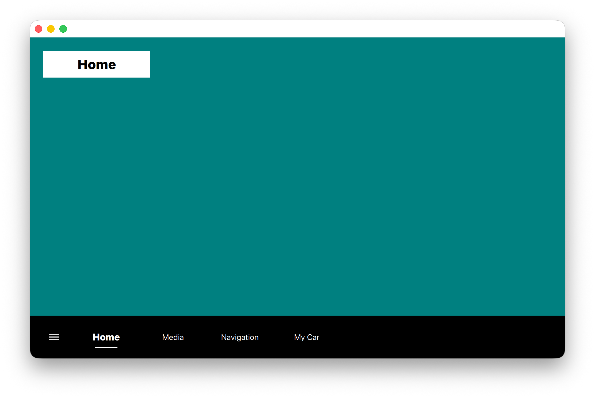
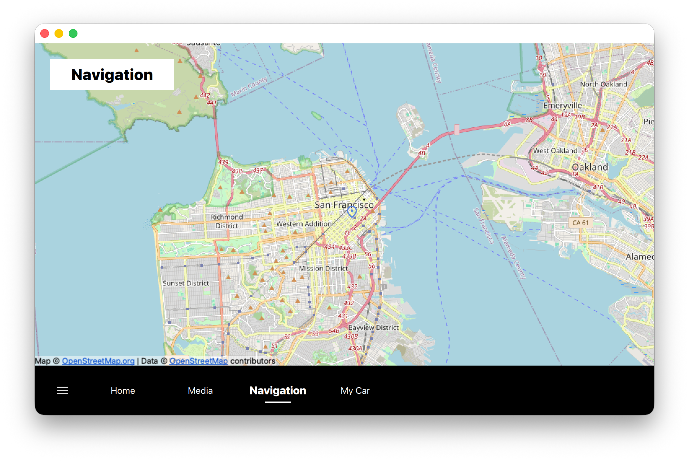
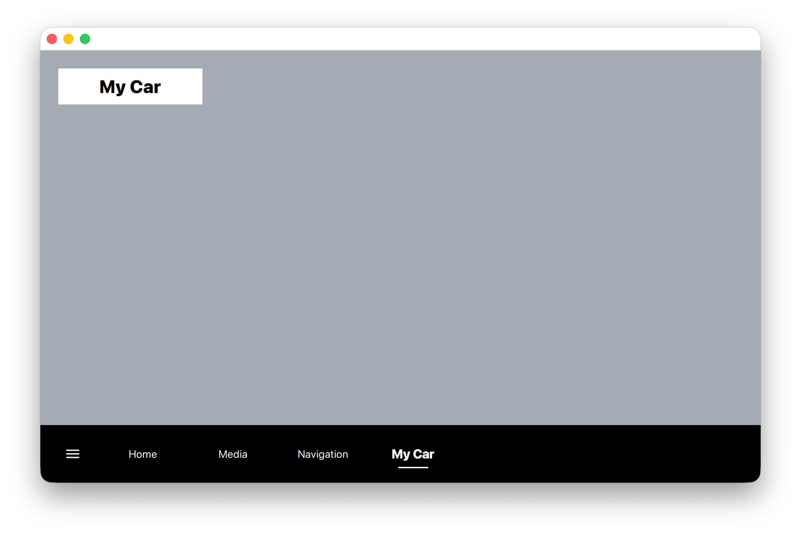

# QtMenuBar
A **Qt6 QML "Menu Bar" application** which demonstrates how to render a custom
menu bar using Qt Quick and a ListModel. It can be used as a reusable UI module
within this project. Note that the menu bar (Footer.qml) is built around a
fixed, example-specific model. It is intended as a reference implementation
although it can be adapted to take in drop-in reusable components.

This project is not intended to be a full-featured application. Instead, it
provides a solid foundation for a potential car infotainment system side
project, focusing on structure, layout, and extensibility.

The application includes four tabs: **Home**, **Media**, **Navigation**, and
**My Car**. While these tabs do not yet provide advanced functionality, the
project served as an opportunity to explore the Qt Location, Qt Positioning, and
OpenStreetMap (OSM) plugins for the first time. Integrating these technologies
was straightforward, and the official Qt tutorials and documentation proved to
be clear and effective.

---

## What this project demonstrates

- Modern **Qt 6 + CMake** project structure
- Ability to build and run a Qt application from source
- Support for **QML UIs**
- Proper use of resources (icons, images)
- Clean, minimal code intended to be easy to read and extend

---

## Technologies used

- C++17
- CMake
- Qt 6
    - Qt Widgets
    - Qt Quick / QML
    - Qt Resource System (QRC)

---

## Screenshots

### Home


### Media


### Navigation


### My Car

---

## Build requirements

- **Qt 6.x**
- **CMake 3.16+**
- A C++17-compatible compiler

Tested with:
- macOS
- Qt 6.x

---

## Building the project

```bash
# From the project root directory, run:
cmake -S . -B build -G "Ninja"
ninja -C build
```
